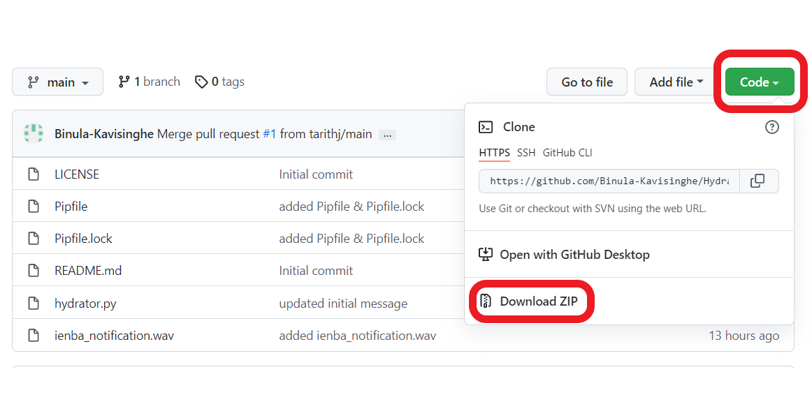

# Hydrator
A python program than reminds you to take a drink once an hour, while at work on your computer.

# Prerequisites

1. Python 3 (https://www.python.org/)
2. Playsound module (https://pypi.org/project/playsound/)

_Run the below command in a cmd window AFTER installing python._
```bash
pip install playsound
```
# Installation

1. Download the code as a zip file.

2. Extract it to a preferred location.


# Running the Program
Run the file `hydrator.py`

# Run on Startup
* Please follow these instructions to [run the script on startup for windows](https://gist.github.com/Binula-Kavisinghe/dbe19095c3e841bc4e978ec1ccd6aed9)
